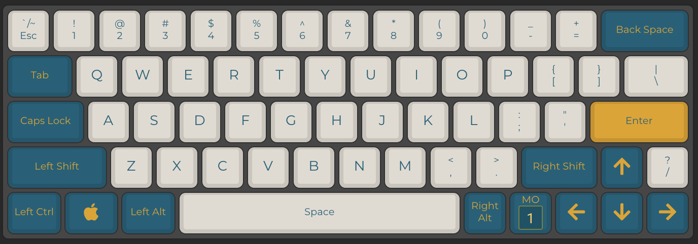
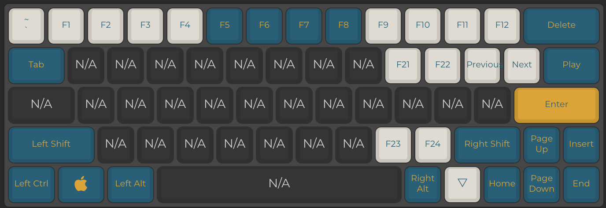

# My Freebird60 QMK Config
included: qmk json and the compiled hex for flashing

### Layer 1

- Standard 60% layout with arrow keys
- Shift toggles tilde ( ~ ) key on Esc
- Fn key toggles the second layer

### Layer 2

- Enables tilde (~) and backtick ( ` ) on Esc
- Numbers 1 through 10, ( - ), ( + ) are Fn 1-12
- Delete (Del) on Backspace
- Remapped navigation keys (Home, Page Up, etc..) to arrow keys
- Fn 21-24 placed for personal keybinds
- Media keybinds on ( [ ), ( ] ), ( \ )
